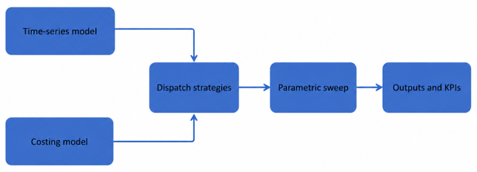

# Photovoltaic Integration and Battery Dispatch at a UK Artificial Intelligence Data Centre: Quantifying the Implementability–Optimality Gap — Simulation Code

## 1. Introduction

This repository contains the Python simulation framework developed for the third-year individual project *Photovoltaic Integration and Battery Dispatch at a UK Artificial Intelligence Data Centre: Quantifying the Implementability–Optimality Gap* (EEEN30330, 2025/26). The software quantifies the annual operating performance of a hypothetical UK AI data centre integrating behind-the-meter photovoltaic (PV) generation and a battery energy storage system (BESS) under 2023 UK market data.

The framework runs an hourly time-series simulation over a non-leap calendar year (8,760 hours) and compares three battery dispatch strategies — a surplus-PV-only baseline, a rule-based controller with daily P10/P90 price-signal arbitrage, and a cost-optimal linear programme with perfect foresight — across a 5×5 parametric sweep of PV (0–4 MW) and BESS (0–4 MWh, 2-hour duration) sizes. For each configuration it computes the full set of KPIs reported in Chapter 4 of the dissertation: total operating cost and its energy / demand-charge / degradation components, imported energy, annual and monthly peak grid import, PV self-consumption and self-sufficiency, battery throughput, and equivalent full cycles.

## 2. Contextual overview

The software implements the five-stage modelling workflow defined in Section 3.2 of the dissertation:



The time-series model and costing model both feed the dispatch strategies block; results are then aggregated across the parametric sweep and reported as outputs and KPIs. All input time series (PV capacity factor, AI utilisation, wholesale prices, DUoS bands) are aligned to a common 8,760-hour UTC index. The system boundary is the site AC bus: PV, BESS, and the grid connection share a common bus, with internal network behaviour and HVAC plant dynamics abstracted into a seasonal PUE multiplier. See Sections 3.2–3.3 of the dissertation for the full scope description.

## 3. Installation

### Required software

- Python 3.10 or later
- GLPK (GNU Linear Programming Kit) — required for the cost-optimal LP solver

### Python dependencies

```text
numpy
pandas
matplotlib
pulp
pytz
jupyter
```

### Environment setup

1. **Install GLPK** (required by PuLP for the LP solver):
   - **Ubuntu/Debian**: `sudo apt-get install glpk-utils`
   - **macOS (Homebrew)**: `brew install glpk`
   - **Windows**: download from <https://sourceforge.net/projects/winglpk/> and add the `w64` folder to `PATH`

2. **Clone the repository and create a virtual environment**:
   ```bash
   git clone <repository-url>
   cd <repository-name>
   python -m venv .venv
   source .venv/bin/activate          # Linux/macOS
   .venv\Scripts\activate             # Windows
   ```

3. **Install Python dependencies**:
   ```bash
   pip install numpy pandas matplotlib pulp pytz jupyter
   ```

4. **Verify GLPK is reachable**: `glpsol --version` should return a version string.

### Notes

Data sources are documented in Appendix F.1 of the dissertation.

The file `data/ukpn_dc.csv` is excluded from this repository because it exceeds GitHub's 100 MB file-size limit. To run the notebook, place `ukpn_dc.csv` inside the `data/` folder.

The notebook reads files using `Path.cwd().parent / "data"`, so it must be run from the `notebooks/` folder.

## 4. How to run

1. Activate the virtual environment created above.
2. Launch Jupyter from the repository root: `jupyter notebook`.
3. Open `notebooks/main.ipynb`.
4. Run cells in order from top to bottom. The notebook is structured to be executed sequentially — later cells depend on dataframes (`df_2023`, `df_bess`, `df_rb`, `df_opt`, `df_sweep`) built earlier.

Approximate run time on a modern laptop: ~30 seconds for the base-case dispatch cells, and several minutes for the full 5×5 parametric sweep (the cost-optimal LP solves 20 separate year-long LPs at 8,760 hours each).

The notebook produces, in order:

- input-data figures (PV CF, AI utilisation, PUE, site load),
- base-case results for each dispatch strategy with annual and sample-week diagnostic plots,
- the 5×5 parametric sweep with heatmaps and line plots,
- the publication-quality figures and tables reproduced in Chapter 4 and Appendix C of the dissertation,
- a verification block that re-derives the main numerical claims made in the report.

## 5. Technical details

### Core equations (full derivations in Chapter 3 of the dissertation)

**Load model** (Eq. 3.1–3.3):

- IT load: `L_IT(t) = u(t) · IT_peak`
- Site load: `L(t) = PUE(t) · L_IT(t)`
- Seasonal PUE: `PUE(t) = PUE_mean + PUE_amp · cos(2π(month(t) − month_peak)/12)`

**PV model** (Eq. 3.4): `G_a(t) = CF(t) · C_PV`

**BESS state of charge** (Eq. 3.6):
`SoC(t+1) = SoC(t) + η_ch · u_ch(t) · Δt − u_dis(t) · Δt / η_dis`

**Power balance at site AC bus** (Eq. 3.7):
`L(t) + u_ch(t) = G_u(t) + u_dis(t) + P_imp(t) − P_exp(t)`

**Cost-optimal LP objective** (Eq. 3.9):
`min { C_energy − C_export + C_demand + C_degradation + C_spill }`

with energy charge `Σ p_imp(t) · P_imp(t) · Δt / 1000`, demand charge `Σ_m α_m · max_{t∈m} P_imp(t)`, and a linear throughput-degradation cost `c_deg · Σ (u_ch(t) + u_dis(t)) · Δt`.

### Design assumptions

- **Single common AC bus**: internal network, voltage/frequency dynamics, reactive power, and HVAC plant dynamics are abstracted into the time-varying PUE multiplier.
- **Linear degradation**: a flat £0.030/kWh throughput cost permits LP rather than DP; depth-of-discharge, C-rate, and calendar ageing effects are excluded (Section 2.3 / 4.4.4).
- **Perfect foresight LP**: the cost-optimal benchmark sees the full 8,760-hour horizon at once, providing a strict lower bound on achievable cost. A cyclic SoC constraint (`SoC_T ≈ SoC_0` within ±1 % of E_max) prevents end-of-horizon discharge artefacts.
- **No simultaneous charge/discharge**: enforced structurally in the rule-based controllers and made cost-suboptimal by the throughput term in the LP — verified at every hour (Appendix G.1).
- **Export disabled**: `P_exp,max = 0` because PV never exceeds load at any tested capacity below the 6,495 kW curtailment threshold.
- **Tariff scope**: the model includes wholesale MIP plus DUoS unit and capacity charges. BSUoS, TNUoS, CCL, and CfD/RO levies are excluded — they scale all strategies equally and do not affect comparative ranking, but absolute totals understate billed cost (Section 4.4.4).

### Integrity checks

Five tests run on every simulation (Appendix G.1):

- Power-balance residual `|ε|` < 0.01 kW at every hour, all controllers
- SoC bounds compliance (no violations)
- No simultaneous charge/discharge under the LP (0 hours)
- Cost-optimal total cost ≤ rule-based total cost across all 25 PV × BESS combinations
- Cyclic SoC constraint met within ±1 % of E_max

## 6. Known issues and future improvements

### Known issues / scope limitations

- The cost-optimal LP requires GLPK; PuLP's bundled CBC solver also works but runs noticeably slower for the full sweep.
- The notebook stores all intermediate results in memory. Running multiple sweeps in the same kernel session can use significant RAM; restarting the kernel between full-sweep runs is recommended.
- The Renewables.ninja GB national average PV series is used in place of a region-specific North-West series, which slightly overstates output for an ENWL-region site (Section 4.1.2). PV savings scale proportionally without affecting strategy ranking.
- The synthetic AI utilisation profile is reproducible (`np.random.default_rng(seed=42)`) but is not metered data. Structural findings are robust; exact rule-based penalty magnitudes depend on the realised hourly pattern.
- The tariff representation excludes BSUoS, TNUoS, CCL, and CfD/RO levies, so absolute annual costs (~£2.1 M) understate actual billed cost.

### Future improvements (mapped to dissertation Section 5.2)

- **NPV / IRR / discounted-payback assessment** combining operating savings with installation, O&M, and replacement costs to enable true sizing optimisation.
- **Peak-import guard + minimum price-spread threshold** added to the rule-based controller, targeting the £13.8k demand-charge and £22.9k degradation penalties identified in Section 4.4.2.
- **Receding-horizon model predictive controller** with day-ahead PV/price forecasts to quantify the fraction of the £24.7k LP–rule gap that survives under realistic forecast uncertainty.
- **Ancillary-service revenue modelling** (frequency response, capacity market, balancing mechanism) — likely the deciding factor in BESS economic viability.
- **Joint sweep over demand-charge rate and degradation rate** to test the 62 / 38 % degradation-vs-demand-charge split across plausible parameter combinations.
- **Multi-year and multi-region replication** using 2022 MIP data and alternative DNO tariff structures.
- **Carbon emissions accounting**: an earlier version of the framework computed scope-2 emissions under both NESO average and a marginal emission-factor proxy. The marginal-factor methodology was insufficiently robust for inclusion in the final report and has been removed; a stronger marginal-emissions treatment (e.g. dispatch-order-based or locational marginal CI) would let the framework address operational carbon impact alongside cost.
- **Lower-priority refinements**: hourly temperature-driven PUE replacing the seasonal sinusoid; non-linear degradation (DoD, C-rate, calendar ageing); time-varying SoC reserve; broader tariff representation; replacement of synthetic load with metered data.
- **Code restructuring**: object-oriented refactor with shared interfaces between controllers, and a `pytest` framework replacing the manual integrity checks.

## References

Anthropic's Claude was used to assist with debugging the simulation code, improving code readability, drafting and formatting code comments to align with the report's terminology and equation references, and structuring this README file (Anthropic, 2026).

Full reference list and data sources are provided in the project report. Key external inputs:

- Renewables.ninja PV capacity factor series — Pfenninger & Staffell
- Elexon Market Index Price (MIP) — Elexon BMRS
- UKPN data-centre half-hourly utilisation — UK Power Networks Open Data
- ENWL "HV Site Specific No Residual" DUoS tariff — Electricity North West Limited (April 2023)
- NESO Carbon Intensity API — National Energy System Operator